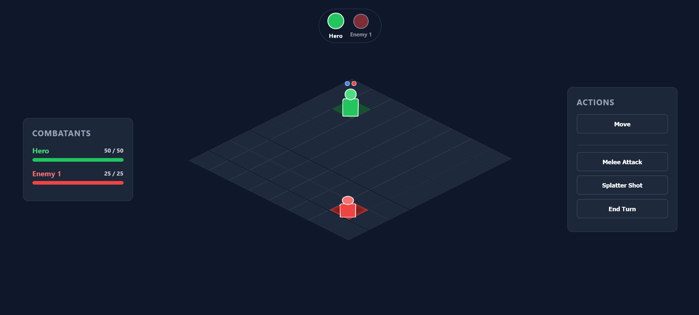

# Simple-Tactical-RPG
A browser-based, turn-based tactical RPG featuring an isometric exploration mode and a multi-action grid combat system built with **React and CSS**.  
This project was created to demonstrate advanced front-end architecture, state synchronization, isometric rendering mathematics, and complex game-loop logic within a component-based framework. (Mostly Vibe Coded)

## Live Demo

Play the project here:  
**https://ian-swartz.github.io/Simple-Tactical-RPG/**

---

## Screenshots

### 3D Exploration Mode


### Tactical Battle Grid


### Splatter Shot AOE Preview


---

## Project Overview

This Simple Tactical RPG is a full-featured web application that seamlessly bridges real-time map exploration with structural, turn-based tactical combat. The project focuses on:

- **Mathematical Isometric Projection:** Converting standard 2D arrays into a simulated 3D spatial grid for both map roaming and battle stages.
- **Dual-Mode Gameplay Loop:** Seamlessly transitioning state from real-time asset exploration to a structured combat arena upon colliding with enemies.
- **Complex Turn-State Management:** Orchestrating a rigid turn timeline between a player and multiple active computer AI units.
- **Polished UI & Gameplay Feedback:** Incorporating structural layout boundaries, absolute world positioning, action counters, and hover preview indicators.

This repository serves as a portfolio piece showcasing React state mastery, performance optimization with dynamic components, and defensive programming workflows for software engineering roles.

---

## Game Modes & Features

### 1. 3D Isometric Exploration Mode
A real-time wandering phase where the player navigates a 3D grid layout populated with structural environmental obstacles.

**Highlights**
- **Dynamic Collision System:** Instant evaluation of user input relative to solid coordinate blocks preventing boundary clips.
- **Camera-Relative Controls:** Translated keyboard input mapped accurately to match the tilted isometric axis perspective.
- **Triggered Battle Event Handlers:** Automated state capture that instantly saves world positions and loads combat parameters upon proximity with enemy entities.

### 2. Tactical Turn-Based Battle Mode
A grid-based combat simulation restricting entity performance to dynamic action resource rules.

**Highlights**
- **Multi-Action Economy:** A flexible system allowing players to execute up to one movement action and one attack type (melee or ranged) per turn in any sequential preference.
- **Visual State Trackers:** Overhead status indicator elements displaying live remaining move/attack capacities via color-coded nodes.
- **Dynamic Grid Navigation Limits:** Path highlight systems mapping actual calculated movement and weapon reach ranges across the layout, while filtering out illegally occupied tiles.
- **Comprehensive Turn Order Timeline:** A floating sequence banner showing upcoming action distribution profiles for all combat participants.
- **Interactive Health Metric Panels:** Split sidebar interface parsing ongoing combatant states, housing synchronous visual health bars alongside raw numerical fractions ($HP / MaxHP$).

### 3. Splatter Shot Mechanic (Ranged Weaponry)
An advanced area-of-effect (AOE) tracking matrix that recalculates splash fields dynamically.

**Highlights**
- **Live Mouse Cursor Capture:** Dynamic detection of hover coordinates to evaluate targeting capabilities.
- **Cross-Form Impact Zone:** Automated styling modifiers highlighting both the primary target and surrounding coordinates in an orange warning splash overlay.
- **Multi-Target Damage Resolution:** Multi-point evaluation routines resolving armor reduction and damage variables against multiple enemies concurrently in a single click.

---

## Tech Stack

- **React.js** (Functional Components & Hooks)
- **CSS3** (Transform-3D Profiles, Flexbox, & Grid Layouts)
- **JavaScript** (State Mapping & Matrix Array Algorithms)

---

## What This Project Demonstrates

This project was built to showcase practical software development and architectural skills, including:

- **Advanced State Synchronizations:** Orchestrating parent-to-child component shifts while strictly preserving base statistics.
- **Isometric CSS Calculations:** Utilizing advanced `transform-style: preserve-3d` and geometric rotations to build spatial layout fields without external heavy graphics engines.
- **Robust AI Algorithms:** Designing basic reactive enemy logic loops managing proximity calculation, obstacle handling, and offensive combat execution.
- **Defensive UI Rendering:** Ensuring responsive scaling, precise overflow management, and intuitive interaction overlays under varied gameplay conditions.

---

## Project Structure
```
Insert project structure here.
```

---

## Author

Developed by: Ian Swartz 
GitHub: https://github.com/ian-swartz

---

Project Created for Millersville CMSC 498 - Independent Study (Web/Game Development)

